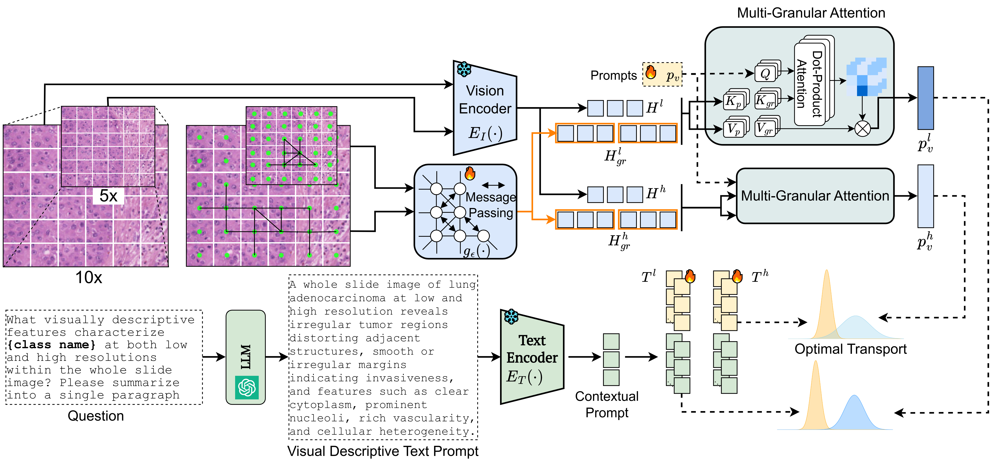

# MGPATH
## MGPATH: Vision-Language Model with Multi-Granular Prompt Learning for Few-Shot WSI Classification

Anh-Tien Nguyen, Duy Minh Ho Nguyen*, Nghiem Tuong Diep*, Trung Quoc Nguyen, Nhat Ho, Jacqueline Michelle Metsch, Miriam Cindy Maurer, Daniel Sonntag, Hanibal Bohnenberger, Anne-Christin Hauschild

(*Equal second contribution)

[]()

[[`Model`](https://huggingface.co/tiennguyen/MGPATH/tree/main)] [[`Paper`](https://arxiv.org/abs/2502.07409)] [[`BibTeX`](#Citation)]


## 💥 📢 News 💥
- **[11.02.2025]**: [Paper](https://arxiv.org/abs/2502.07409) is now available on arXiv !
- **[27.02.2025]**: MGPath(PLIP-G) [Hugging Face](https://huggingface.co/tiennguyen/MGPATH/tree/main) models are released !
- **[27.02.2025]**: PLIP-G aligment [Hugging Face](https://huggingface.co/tiennguyen/MGPATH/tree/main) models are released !
- **[27.02.2025]**: TCGA-NSCLC's embeddings [Hugging Face](https://huggingface.co/datasets/tiennguyen/MGPATH) extracted by Prov-GigaPath are release 

## Development Environment Installation

please refer to the installation guide [Development Environment Installation](docs/env/env.md)

## Reproducibility

For the testing, validation, and training slide IDs, please refer to the [splits](splits) directory.

## Model Download

The aligment (Prov-GigaPath and PLIP's text encoder) weight can be download from [Hugging Face](https://huggingface.co/tiennguyen/MGPATH/tree/main).
After downloading, please copy the weights to the directory [weights](weights) 

## Model Overview

<p align="center">
     <br>

  *Overview of MGPath model architecture*

</p>

## Evaluate Model's Performance

```bash
python3 evaluator.py \
        --seed 2024 \
        --k_start 0\
        --k_end 4\
        --input_size 1024\
        --config '../yaml/tcga_lung.yml'\
        --checkpoint_dir '../weights/nsclc'\
        --splits_dir '../splits/nsclc/'\
        --ratio_graph '0.2'\
        --alignment '../weights/alignment/plip_alignment.pth'\
        --free_text_encoder \
        --output_dir 'eval_results'
```

## Acknowledgement

The authors gratefully acknowledge the computing time granted by the KISSKI project. The calculations for this research were conducted with computing resources under the project **kisski-umg-fairpact-2**.

The authors gratefully acknowledge the computing time granted by the Resource Allocation Board and provided on the supercomputer Emmy/Grete at NHR-Nord@Göttingen as part of the NHR infrastructure. The calculations for this research were conducted with computing resources under the project **nim00014**.


## Usage and License Notices

The model is not intended for clinical use as a medical device, diagnostic tool, or any technology for disease diagnosis, treatment, or prevention. It is not a substitute for professional medical advice, diagnosis, or treatment. Users are responsible for evaluating and validating the model to ensure it meets their needs before any clinical application.

## Citation
If MGPath is useful for yoru research and applications, please cite using this Bibtex:

```bibtex
@misc{nguyen2025mgpathvisionlanguagemodelmultigranular,
      title={MGPATH: Vision-Language Model with Multi-Granular Prompt Learning for Few-Shot WSI Classification}, 
      author={Anh-Tien Nguyen and Duy Minh Ho Nguyen and Nghiem Tuong Diep and Trung Quoc Nguyen and Nhat Ho and Jacqueline Michelle Metsch and Miriam Cindy Maurer and Daniel Sonntag and Hanibal Bohnenberger and Anne-Christin Hauschild},
      year={2025},
      eprint={2502.07409},
      archivePrefix={arXiv},
      primaryClass={cs.CV},
      url={https://arxiv.org/abs/2502.07409}, 
}
```
